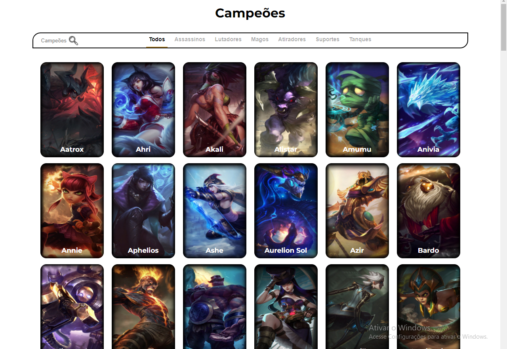
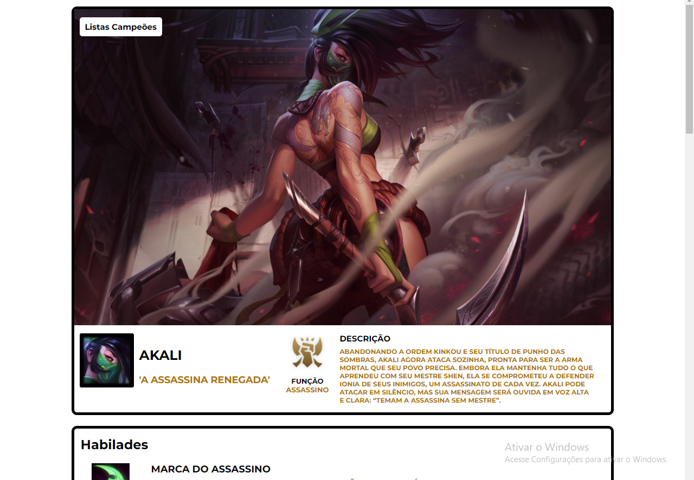
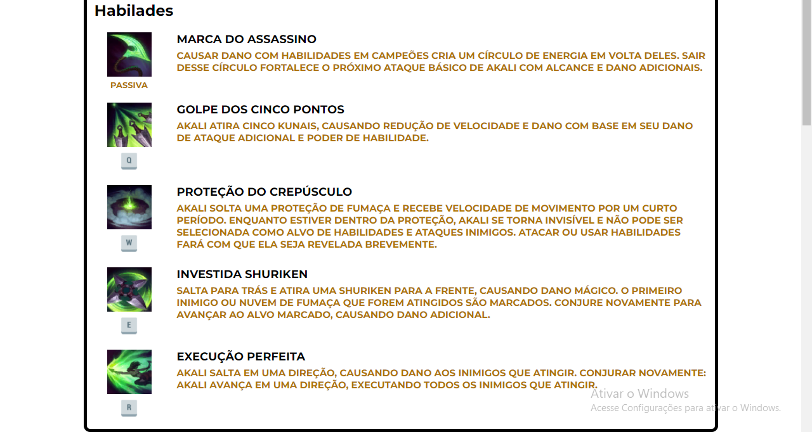
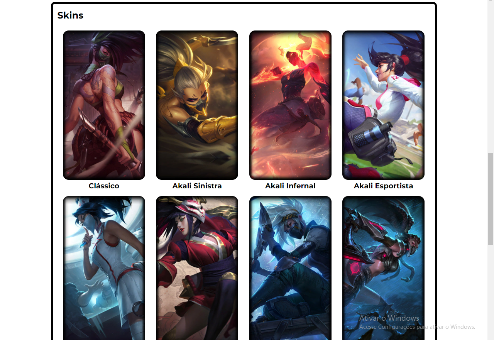

<h1 align="center">League Of Legend API</h1>

O projeto mostra todos campeões do league of legend e tbm mostra informações de cada campeão e tudo isso usando API da Riot

## Imagens de demonstração

    
    
    
    

 

## Instalação
Você pode clonar o repositório ou baixar o .zip

